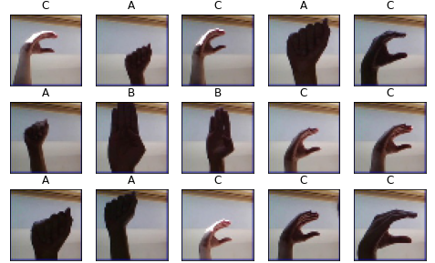

# ASL Recognition
American Sign Language (ASL) is natural sign language of the deaf community in the United States and most Canadian anglophones. ASL is expressed by hand and facial movements. This project explores how deep learning can be used to translate sign language to spoken language. For now the datasets only contain ABC sign. Famous machine learning library, TensorFlow, will be used alongside scikit-learn.

## Tutorial
More detailed steps available on jupyter notebook. You can see the result [here](https://www.kaggle.com/lazuardinfl/asl-recognition/) or you can try the demo itself [here](https://www.kaggle.com/kernels/fork/18210511).
1. Import packages and load datasets
2. Visualize some of the images in the training dataset
3. Count total images of each letter in datasets.
4. Use Keras function to one-hot encode the data
5. Define CNN model
6. Compile the model
7. Train the model
8. Test and evaluate the model
9. Visualize incorrect prediction
